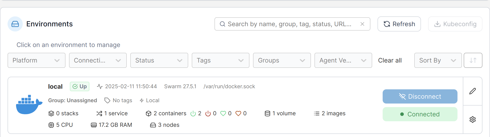
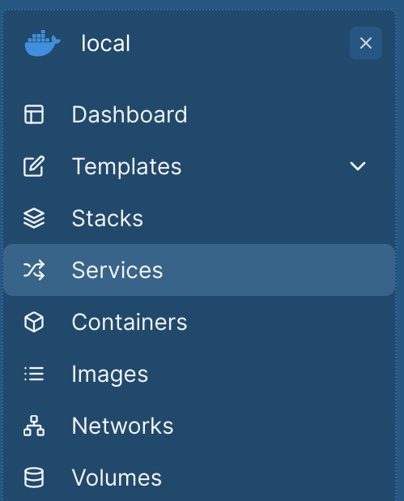
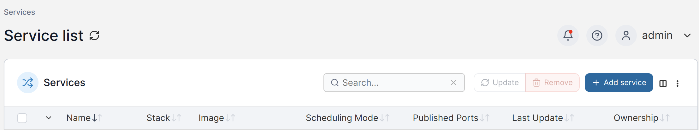
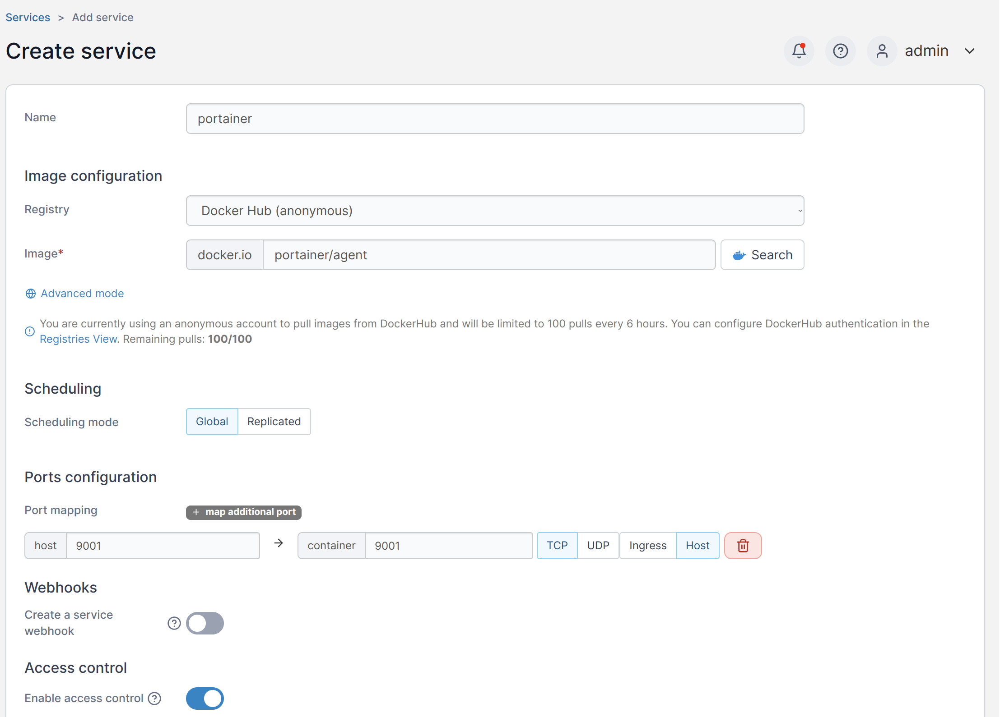
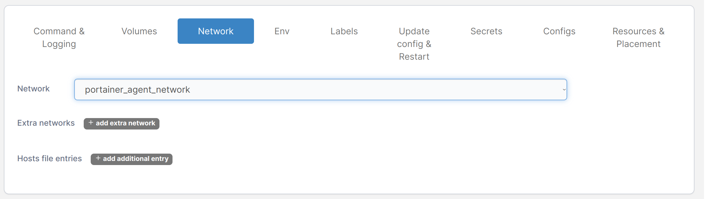
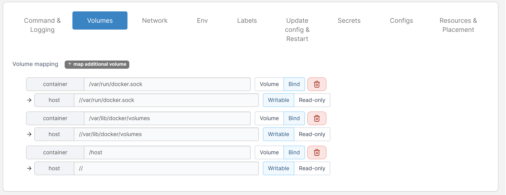
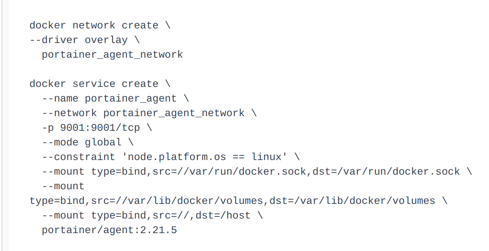
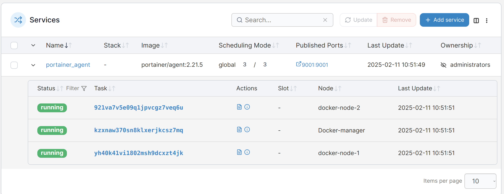
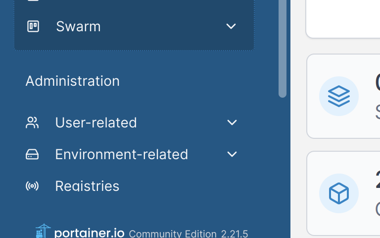

# Configuration de Portainer pour SWARM

## Mise en place du swarm
Veuillez récupérer la commande affiché à l'écran commenceant par :
```
docker swarm join --token SWMTKN-1-5lrebm28fiqi22ihg0ueehtjumql9d3skaj3uqevdj56qwy2wg-dv59ktfk632756mi4idp6v2tp 10.0.0.51:2377
```

Et la taper sur chaque noeud où le script `script-node.sh`à été éxécuté. N'oubliez pas de l'éxécuter en `sudo`.

## Mise en place du service
Se rendre sur son serveur portainer présent sur docker manager

```
https://IP-docker-manager:9443
```

Une fois que les noeuds ont été lié au manager, vous pouvez passer aux étapes suivantes :

### Se rendre sur l'environnement local :



### Se rendre dans services :



### Cliquer sur `add-service` :



### Ajouter les services comme suivant :

#### Infos générales : 


#### Network : 


#### Volumes :


Ces commandes permettent de reproduire les commandes CLI suivantes :



### vérifier que le déploiement est ok :


## Création de l'env Docker swarm : 

### Se rendre dans le menu des env `Environment-related` :
